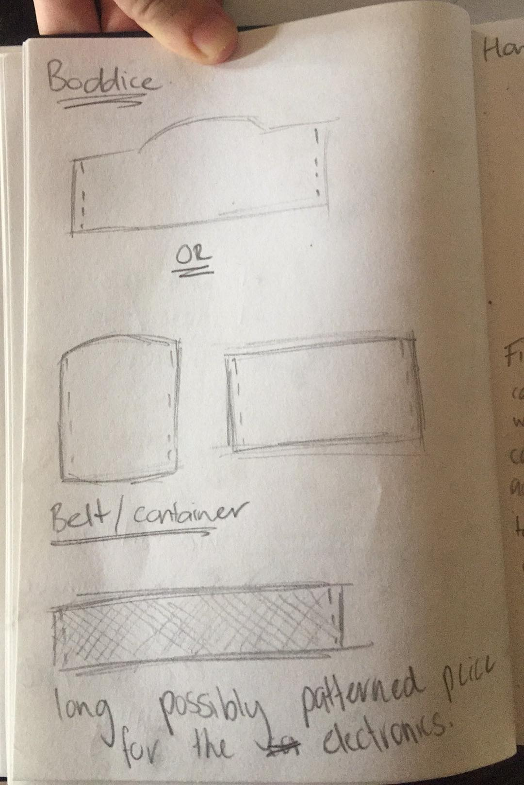
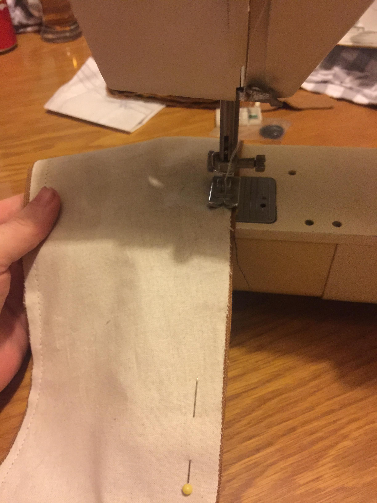

# 1701QCA Making Interaction - Assessment 3 workbook

## Project working title ##
LED dress

## Related projects ##
*Find about 6 related projects to the project you choose. A project might be related through  function, technology, materials, fabrication, concept, or code. Don't forget to place an image of the related project in the appropriate folder and insert the filename in the appropriate places below. Copy the markdown block of code below for each project you are showing.*

### Related project 1 ###
*Fiber Optic Lighting for Wearable Tech: Beginner How-To Guide*

https://www.youtube.com/watch?v=nitoFevfIJg


This project is related to my original project idea. Originally I was going to try and create a dress that showed a piece of artwork relating to music. The art-work was going to be animated and show on the skirt of the dress.


### Related project 2 ###
*Interactive Video Projection Dress: Wearable Tech*

https://www.youtube.com/watch?v=su30-wiF7m4

This was another lighting idea that I had for the dress, but I decided that making this dress would get way too expensive.


### Related project 3 ###
*LED Lights for Wearable Tech: Beginner How-To Guide*

https://www.youtube.com/watch?v=FxvBVvBWh4I

Watching this video gave me an insight on how cool LED's in fabric could look. From this video I came up with my final project idea.


## Other research ##
- Micro:bit experiment 2
- Micro:bit experiment 9
  - Capacitor charge circuit
  
  ### Tutorials ### 
  - [Transistors] (https://learn.sparkfun.com/tutorials/transistors)
 - [Switches] (https://learn.sparkfun.com/tutorials/transistors#applications-i-switches)

### *Brief resource name/description* ###

*Provide a link, reference, or whatever is required for somebody else to find the resource. Then provide a few comments about what you have drawn from the resource.*

## Conceptual progress ##

### Design intent ###
*Include your design intent here. It should be about a 10 word phrase/sentence.*

### Design concept 1 ###
*Interactive Toy Robot*


When interacted with in different ways, it will display different emotions with a sound and visual.

### Design concept 2 ###
*Holo Chess Board*

 

Inspiration from the Holo Chess played in the Star Wars films.

### Final design concept ###
*Fiber optic Dress/LED dress*


For this project I wanted to be able to incorporate fibre optics and RGB LEDs. This would be achieved by serving the electronics into the dress.

### Interaction flowchart ###
*Draw a draft flowchart of what you anticipate the interaction process in your project to be. Make sure you think about all the stages of interaction step-by-step. Also make sure that you consider actions a user might take that aren't what you intend in an ideal use case. Insert an image of it below. It might just be a photo of a hand-drawn sketch, not a carefully drawn digital diagram. It just needs to be legible.*


## Physical experimentation documentation ##

*In this section, show your progress including whichever of the following are appropriate for your project at this point.
a.	Technical development. Could be code screenshots, pictures of electronics and hardware testing, video of tests. 
b.	Fabrication. Physical models, rough prototypes, sketches, diagrams of form, material considerations, mood boards, etc.
Ensure you include comments about the choices you've made along the way.*

*You will probably have a range of images and screenshots. Any test videos should be uploaded to YouTube or other publicly accessible site and a link provided here.*


## Beginning Circuitry ##
<video src="video/light-led-switch.mp4" width="512" height="256" controls preload></video>

In the beginning I started with a simple circuit based off tutorials in the micro:bit experiment book. This helped me gain a basic understanding of what was needed for this project.

Parts used:
- 2 LED lights
- Micro:bit
- Light sensor

The code for the project is linked below:
```javascript
let percentage = 0
let cap_voltage = 0
let on_perc = 30

basic.forever(function () {

    cap_voltage = pins.analogReadPin(AnalogPin.P0)
    percentage = cap_voltage / 10

    //basic.showNumber(cap_voltage)

    if (percentage > on_perc) {

        pins.digitalWritePin(DigitalPin.P1, 0)
        pins.digitalWritePin(DigitalPin.P2, 1)

        basic.showLeds(`
            # . # . #
            . # # # .
            # # # # #
            . # # # .
            # . # . #
            `)
    } else {

        pins.digitalWritePin(DigitalPin.P1, 1)
        pins.digitalWritePin(DigitalPin.P2, 0)

        basic.showLeds(`
            # # # . .
            . # # # .
            . . # # .
            . # # # .
            # # # . .
            `)
    }
})
```

 


## Pattern Pieces ##
For this project I used a pattern from *Kwik Sew* in the style K4001 version B. This created the base for this project. I used this pattern because I have based a few of my dresses from it before my project.

 

 


## Sewing ##
  

In this photo I am sewing the lining of the belt to the velvet on the outside. This will be where the electronics will be held later.

Here I am cutting out the boddice pieces (x1 front, x2 1/2 pieces) I will later stitch in buttons and button holes to get in and out of the dress.

 

In this image I have put right-sides of the fabric together to hand stitch the belt to the boddice.

This is the final result of the boddice being stitched to the belt.

 

This was my third attempt at trying to pin and stitch this tulle. Due to my sewing machine being too old to sew it together by itself, I had to result to pinning the tulle to the base skirt and hand stitching the whole dress together.

This is the final outcome of the dress all stitched together without the circuit built in.


## Painting ##
In this photo I am painting the lights that will go into the dress.


## Final Circuit ##
Below is the final circuit and the circuit for the mosfet that Ged provided. For this circuit I required two battery packs, one for the microbit and one to power the lights.
 


 


## Design process discussion ##
For this project I decided to create a dress that displays different colours depending on the amount of light. I had two different ideas for now to illuminate the dress.
- Fibre optics with LED lights
- Wire LED's

The lighting option I chose for this project was the cheapest lighting option that I could come up with and the most effective with the materials that I have.

## Final Product ##
<video src="video/dress_lighting.mp4" width="512" height="256" controls preload></video>
